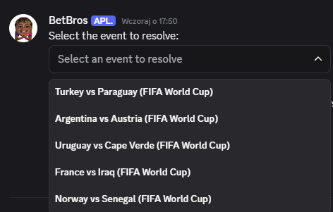
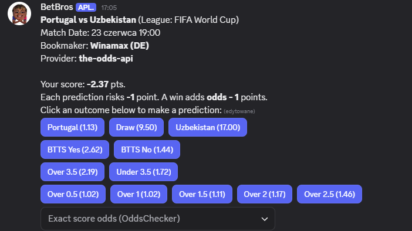
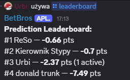

# BetBros Discord Bot

A Node.js Discord bot for score-based soccer predictions and leaderboards.

## Features
- Score-based predictions using external bookmaker odds
- Fixed-risk scoring: loss = -1, win = odds - 1, void = 0
- Match-winner, draw no bet, BTTS, goal totals, and exact-score predictions
- Leaderboards based on prediction score
- Automatic and manual bet resolution
- Legacy coin commands kept under `/legacy...`
- (TODO) Channel and moderator role configuration
- (TODO) Leaderboards (weekly, monthly, total)

## Commands
- `/bet` - score-based prediction flow using external odds
- `/balance` - show your prediction score
- `/leaderboard` - show non-zero prediction scores
- `/mybets` and `/displaybets` - show active predictions
- `/resolvebet` - manual admin settlement, including final-score settlement
- `/resolveapibet` - admin settlement from external score sources
- `/legacy...` commands - old coin/crate/custom-bet flows

## Screenshots
### Match Selection


### Bet Options


### Leaderboard


## Tech Stack
- Node.js
- TypeScript
- discord.js
- MongoDB
- node-fetch
- cheerio for OddsChecker HTML/JSON extraction

## Data Providers
The bot stores rewards from external odds, not odds derived from user bets.

- API-Football / API-Sports is the primary football provider for fixtures, match-winner odds, and final scores when the free plan allows the season/date.
- The Odds API is used as a fallback for match-winner and extra fixture markets such as draw no bet, BTTS, and totals.
- OddsChecker is used for World Cup correct-score odds. The scraper loads the match page, extracts embedded Hypernova market metadata, then calls OddsChecker's all-odds market endpoint and maps the best decimal price for each score.
- SofaScore is a fallback score/schedule source. It is not the primary odds provider because access can be locked or changed without notice.

## Scraping And Proxy Details
Scraping is isolated behind provider-specific helpers so command code stays mostly provider-agnostic.

- `src/features/sofaScoreClient.ts` wraps SofaScore API fetches. With `USE_PROXY=false`, it calls SofaScore directly using browser-like mobile headers and a referer. With `USE_PROXY=true`, it routes through either Scrape.do or ScrapingAnt.
- `SOFASCORE_PROXY_PROVIDER=scrape-do` builds requests like `https://api.scrape.do/?token=...&url=...` and supports `SCRAPE_DO_SUPER`, `SCRAPE_DO_GEO_CODE`, `SCRAPE_DO_DEVICE`, `SCRAPE_DO_RENDER`, and `SCRAPE_DO_CUSTOM_HEADERS`.
- `SOFASCORE_PROXY_PROVIDER=scraping-ant` uses ScrapingAnt's general endpoint. ScrapingAnt may return JSON inside a `content` field or an HTML `<pre>` wrapper, so the client extracts and parses that payload.
- `src/features/oddsChecker.ts` uses Scrape.do when `SCRAPE_DO_TOKEN` is set, otherwise it tries direct HTTP. OddsChecker is geo-sensitive, so the default OddsChecker Scrape.do geo code is `gb`.
- If SofaScore returns `423 Locked`, prefer Scrape.do with `SCRAPE_DO_SUPER=true`; if using ScrapingAnt, try residential/proxy-country settings.

## Scoring And Settlement
- New predictions are saved in the same `Bet` collection with `scoringMode: "score"` and `amount: 1`.
- Score deltas are calculated in `src/utils/scoreSettlement.ts`: win = `odds - 1`, loss = `-1`, void = `0`.
- Settlement rules live in `src/utils/betResolution.ts` and support match winner, exact score, draw no bet, BTTS, and total goals.
- Settlement writes go through `src/utils/applyBetSettlement.ts`, which claims a bet, applies the user delta once per bet, and records the bet as resolved.
- `User.settledBetIds` makes score/coin updates idempotent if a resolver crashes and retries.
- A partial unique index on active score predictions prevents duplicate active predictions from fast double-clicks.

## Resolver Behavior
- Auto-resolve groups unresolved bets by event id, event name, and match date, so rematches and reused provider ids do not collide.
- Result lookup tries numeric API-Football fixture id first, then searches API-Football and SofaScore on the match date, previous day, and next day. This helps with timezone and midnight fixtures.
- Team matching normalizes diacritics and common aliases such as `Cape Verde` / `Cabo Verde`, `Turkiye` / `Turkey`, and `Cote d'Ivoire` / `Ivory Coast`.
- `/resolvebet` remains the manual fallback when APIs cannot access an old date or a source changes shape.

## Development Scripts
- `npm run build` - clean `dist/` and compile TypeScript
- `npm run start` - build and run the compiled bot
- `npm run start:dev` - run TypeScript watch and restart the bot when `dist/` changes
- `npm run register` - build and register Discord slash commands
- `npm run test:bet-resolution` - build and run settlement regression tests

## Setup
1. Install dependencies:
   ```sh
   npm install
   ```
2. Create a `.env` file:
   ```env
   DISCORD_TOKEN=your-bot-token-here
   MONGO_URI=your-mongodb-uri
   NOTIFICATION_CHANNEL_ID=your-discord-channel-id
   ADMIN_USER_ID=your-discord-user-id

   API_FOOTBALL_KEY=your-api-football-key-here
   API_FOOTBALL_HOST=v3.football.api-sports.io
   API_FOOTBALL_SEASON=
   API_FOOTBALL_CORRECT_SCORE_BET_ID=
   API_FOOTBALL_MATCH_WINNER_BET_ID=

   ODDS_API_KEY=your-the-odds-api-key-here

   USE_PROXY=false
   SOFASCORE_PROXY_PROVIDER=scrape-do
   SOFASCORE_BOOKMAKER_ID=1137

   SCRAPE_DO_TOKEN=your-scrape-do-token-here
   SCRAPE_DO_SUPER=true
   SCRAPE_DO_GEO_CODE=pl
   SCRAPE_DO_DEVICE=
   SCRAPE_DO_RENDER=false
   SCRAPE_DO_CUSTOM_HEADERS=false

   ODDSCHECKER_SCRAPE_DO_SUPER=true
   ODDSCHECKER_SCRAPE_DO_GEO_CODE=gb
   ODDSCHECKER_SCRAPE_DO_DEVICE=
   ODDSCHECKER_SCRAPE_DO_RENDER=false

   SCRAPING_ANT_API_KEY=your-scrapingant-key-here
   SCRAPING_ANT_BROWSER=false
   SCRAPING_ANT_PROXY_TYPE=
   SCRAPING_ANT_PROXY_COUNTRY=
   ```
   API-Football free plans can reject unsupported seasons or dates. When that happens, `/bet` falls back to The Odds API for supported leagues, and resolvers fall back to SofaScore where possible.
3. Start the bot:
   ```sh
   npm run start
   ```

## Folder Structure
- `src/` - main source code
  - `commands/` - Discord command handlers
  - `events/` - Discord event listeners and modal handling
  - `features/` - external provider clients and scraping helpers
  - `db/` - MongoDB models
  - `utils/` - settlement, formatting, and odds helpers

---
Replace placeholders and extend features as needed for your use case.
